-------------------------------------------------------------------------------------------------------
### Please note: I am the first language is ISL (Irish Sign Language). I write in the second English language. I hope you read and understand the ReadMe.
-------------------------------------------------------------------------------------------------------

## Concept Project

* The concept project for the Tic Tac Toe. The design function is very basically in Python.

- The projects development follows below:

## Flowchart 
* Design for the functions:

See Flowchart click here

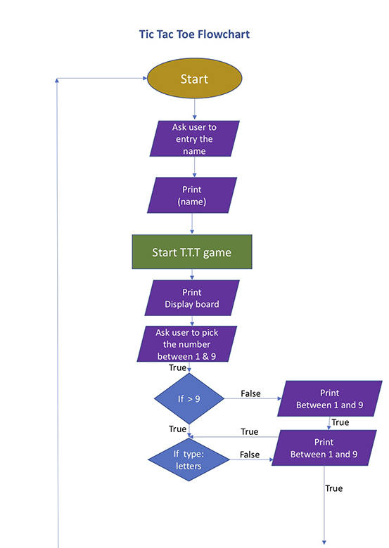
 
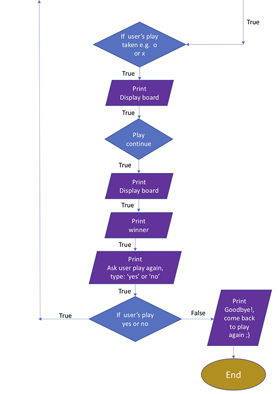

-------------------------------------------------------------------------------------------------------
# Design and development the Tic Tac Toe in Python

## Logo: Tic Tac Toe
- The logo head Tic Tac Toe, the font color is red and the background is white.
- When the user entry name then The display shows up "Hello 'username' and 'Welcome to play Tic Tac Toe'.
- The rule is display to instructed how to play the game. 

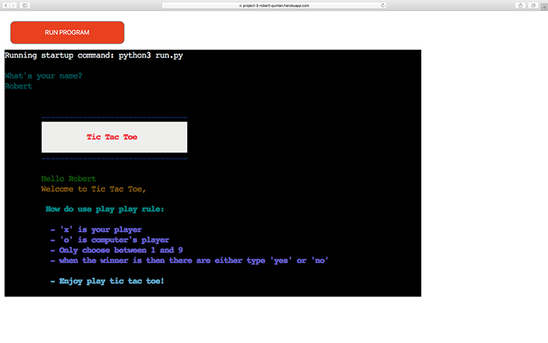

Features
-------------
* The Tic Tac Toe have two players play turning between the computer and human. The compputer's player is 'o' and human's player is 'x'. 

Existing Features
-----------------------
### Start game

* <strong>The T.T.T begin game.</strong> 
  - Please see the function as flowchart as see above [Flowchart](#flowchart). I am put the images sections to decrible lists how the player is beginning.... 

<strong style="font-size:18px">See images sections click here</strong>

## Ask user entry the name
 
  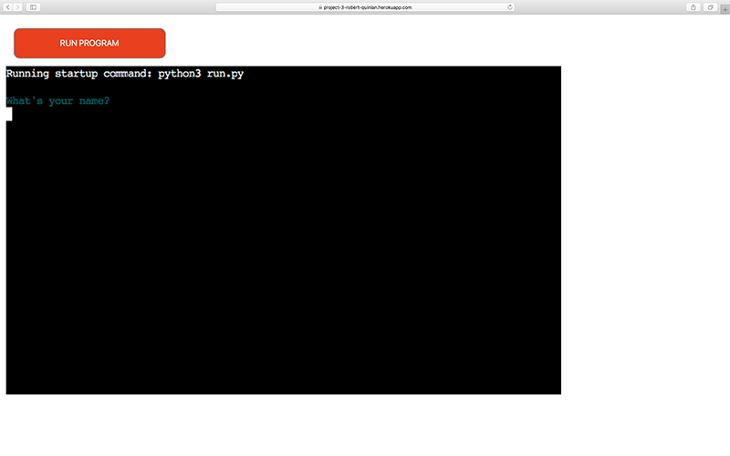
 

## Start game
 
  
 

## Ask user press the number between 1 and 9
 

  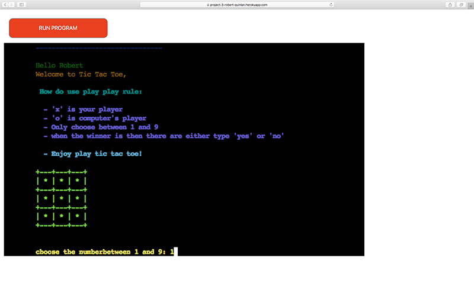
 

## The human player's winner by 'x'
 

  
 

## The computer player's winner by 'o'
 

  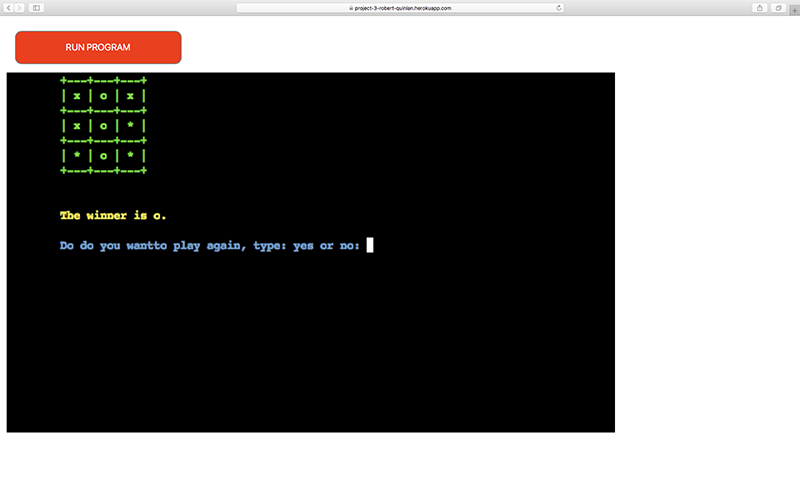
 

## The tie 
 

  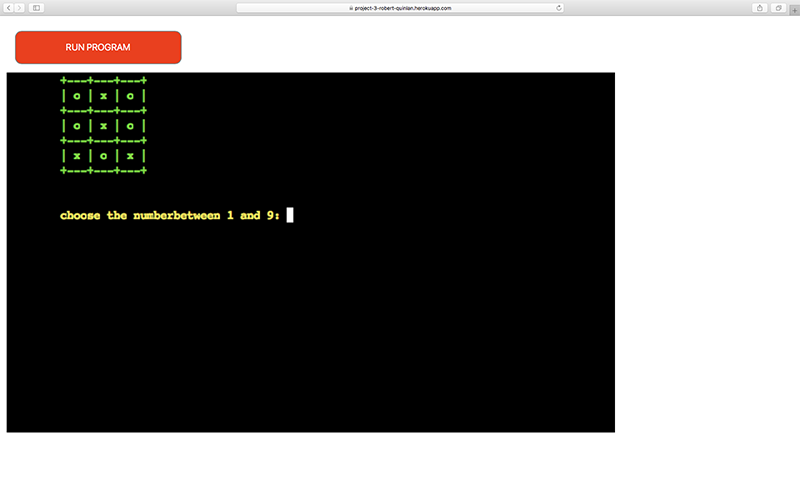
 

## Ask user to play again either typing 'yes' or 'no'
 

  
 

## The human player to type "yes" then the computer's player will start at the first then turn human player conitune...
 

  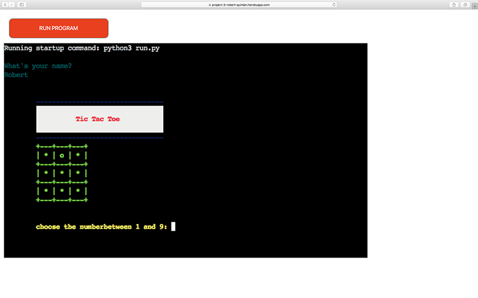
 

## Error handlers
  - Over 9 number to show up error

  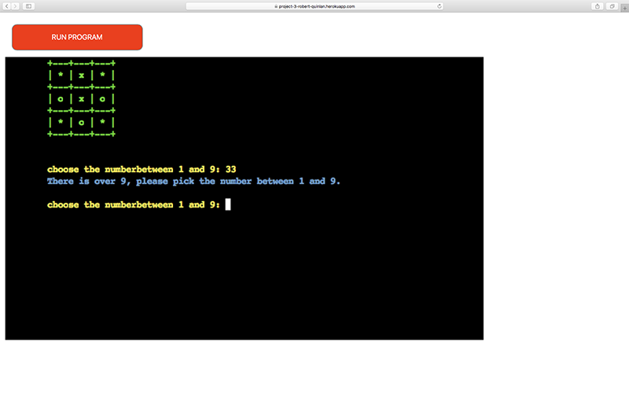

  - letter error, to ask user entry the number between 1 and 9

  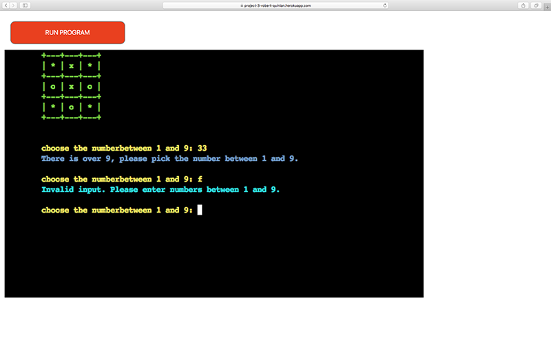

  - Error show up the player taken either 'x' or 'o'

  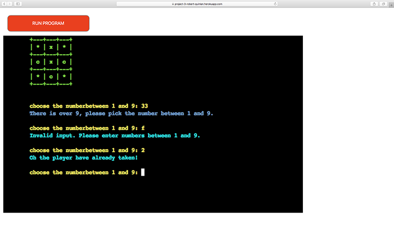

  - Error show up, ask the user to typing 'yes' or 'no'

  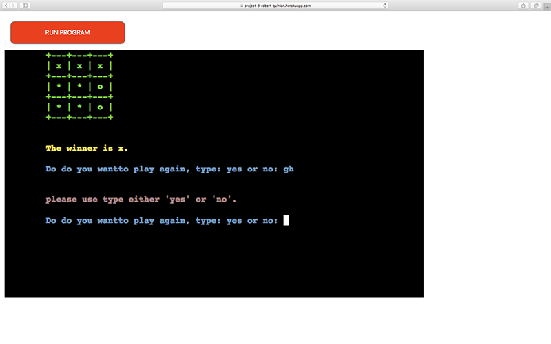

## Ask the user, the human player type 'no' the display show up to say "Goodbye! Come back to play again :)"
 

  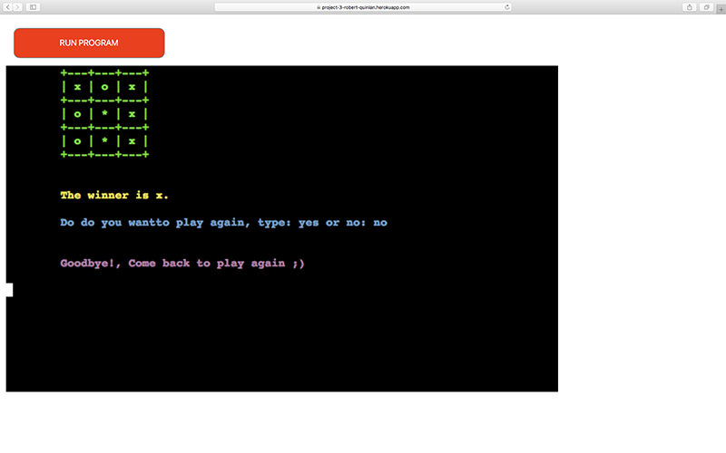
 
 

 

## Testing 

### The browser compatibility
* The testing runs testing for Chrome, Opera, Microsoft Edge, Safari and Firefox for Heroku app. I found the Chrome, Opera and Micosoft Edge, it does not great visual while you are playing game. I would not recommand to use those.

* I am finding the Safari and Firefox, it does very clear visual while the playing. I would recommand to use Safari or Firefox.

### The devices

* I was testing on my iphone and seem it does not working at all but my mention Rory does working on his mobile device.

### The test running game in Heroku app

* Almost the function works except the check_draw does not working because I want to see prompt "it's tie on the screen when it was tie. 

* It was working before when I asked tutor because I found it have some glitch and I want to solution check_draw. we tried to figure it out what was problem. Unforunately, my time allowance was hit up. I ran to fix sereval times and could not find solution. My deadline was so closed then I stop to fix and move on to do ReadMe. 

## Validation testing

# Deployment

The GitHub page where is deployed. How do processing the site deployed as follows:

* Use files on the GitHub page and choose one of the files where it is in the “portfolio-project-1-robert-quinlan” file
* Click on setting 
* On the left side follow the list of options
* To click on ‘page’
* The source under the option to “Deploy from a Branch”
* The Branch under to open to main and root then click to save. 
* It ran the deployment processing while it is successful.

The site lives at [Movie Quiz](https://rqisl.github.io/portfolio-project-2-robert-quinlan/)

## Credits

I was nervous to do projects because I had experienced how difficult through javascript where I studied for Multimedia BA degree. I started project 2, I found it was extremely difficult all over again. My concept was before start developing the site and turn out I was not able to full completed which are get result, age group and time up game. I had spend to learning other resource a lot of time. I tried to understand the javascript but I was disppointed because I could not understand what they have explaining. Cause it was not my first English language. 

My mentor had good feedback and helps with my process improvement on site project. 

## Resouce & tutorial
* ### I learned as many resources as possible I could learn.

1) [Ridpidapi video for API to get images of the poster](https://www.youtube.com/watch?v=ytNyibPQFhw) 
1) [Pick one of the images how to use](https://makersaid.com/array-of-images-in-javascript/)
1) [Hidden Click](https://www.w3schools.com/css/tryit.asp?filename=trycss_display) 
1) How can I structure the quiz concept?
    - [Example quiz 1](https://simplestepscode.com/javascript-quiz-tutorial/)
    - [Example quiz 2](https://www.youtube.com/watch?v=f4fB9Xg2JEY) 
1) [Output result](https://codepen.io/yaphi1/pen/NpZvJp)
1) [How can  I do the question to the next slide](https://www.youtube.com/watch?v=uAAD3mmQGRQ)
1) [Array through to Code Institute resource](https://learn.codeinstitute.net/courses/course-v1:CodeInstitute+LMR101+2021_T1/courseware/0a4bf408d10c4149bb686457ac11edf6/9ad9ed6044aa49c0ae12507f3c03aa79/)
1) [Entry username on the screen through Code Institute](https://learn.codeinstitute.net/courses/course-v1:CodeInstitute+LMR101+2021_T1/courseware/0a4bf408d10c4149bb686457ac11edf6/16d62f1111064f5cb6a64582da96a41b/?child=last.)
    - [Example 1](https://youtu.be/Iw6fyph6MNw)
    - [Example 2](https://youtu.be/KB6Yg5hNrqc)
    - [Example 3](https://www.youtube.com/watch?v=aEj0Wu33hJM) 
1) Click highlight
    - [Example 1](https://learn.codeinstitute.net/courses/course-v1:CodeInstitute+LMR101+2021_T1/courseware/0a4bf408d10c4149bb686457ac11edf6/fe180c06af614d2f86e32957ae17a859/?child=last) 
    - [Example 2](https://learn.codeinstitute.net/courses/course-v1:CodeInstitute+LMR101+2021_T1/courseware/0a4bf408d10c4149bb686457ac11edf6/fe180c06af614d2f86e32957ae17a859/?child=last)
    - [Example 3](https://stackoverflow.com/questions/39852228/style-backgroundcolor-doesnt-work)
1) Click highlight remove and active 
    - [Example 1](https://learn.codeinstitute.net/courses/course-v1:CodeInstitute+LMR101+2021_T1/courseware/0a4bf408d10c4149bb686457ac11edf6/37e3becd93804fdf8bf586523f56ead5/5?activate_block_id=block-v1%3ACodeInstitute%2BLMR101%2B2021_T1%2Btype%40html%2Bblock%404b2504c0ab4e40d6b42d4b527776707a)
    - [Example 2](https://softauthor.com/make-selected-clicked-button-active-in-javascript/)
1) [Output HTML in javascript](https://learn.codeinstitute.net/courses/course-v1:CodeInstitute+LMR101+2021_T1/courseware/0a4bf408d10c4149bb686457ac11edf6/37e3becd93804fdf8bf586523f56ead5/) 
1) [Overlay 3 W School](https://www.w3schools.com/howto/howto_css_overlay.asp)
1) For loop
    - [Example 1](https://www.w3schools.com/jsref/tryit.asp?filename=tryjsref_onclick)
    - [Example 2](https://www.w3schools.com/jsref/tryit.asp?filename=tryjsref_foreach)
    - [Example 3](https://www.freecodecamp.org/news/javascript-foreach-js-array-for-each-example/amp/)
    - [Example 3](https://www.freecodecamp.org/news/javascript-foreach-js-array-for-each-example/amp/)

## Adobe Photoshop & Illustrate

* The logo images where I created the Photoshop. I downloaded the image comes from [www.vecteezy.com](https://www.vecteezy.com/vector-art/19115573-creative-business-card-and-logo-template-album-film-movie-reel-vector-illustration). It is free licence. I choose a roll movie image and edited to create a logo where I used Adobe Illustrate. 
* The layout movie poster on the front page which comes from [www.wallpaperflare.com/](www.wallpaperflare.com/), It is free to allow download who wish to use wallpaper on the usernames' desktop, laptop, tablet or mobile.
* I downloaded three movie posters:
    - [Matrix](https://www.wallpaperflare.com/the-matrix-poster-movies-neo-keanu-reeves-morpheus-carrie-anne-moss-wallpaper-mjcss/download/1920x1200)
    - [Avengers](https://www.wallpaperflare.com/marvel-avengers-the-avengers-avengers-age-of-ultron-thor-wallpaper-zkw/download/1920x1200)
    - [Spiderman](https://www.wallpaperflare.com/spider-man-movies-spider-man-3-marvel-comics-black-suited-spiderman-wallpaper-pnkas/download/1920x1200)
* I made an overlapping layout of the movie posters where I used Adobe PhotoShop 

## Concluded 

* I completed my concept project for the Movie Quiz. I created very basic on javascript. The site lives [Movie Quiz](https://rqisl.github.io/portfolio-project-2-robert-quinlan/).